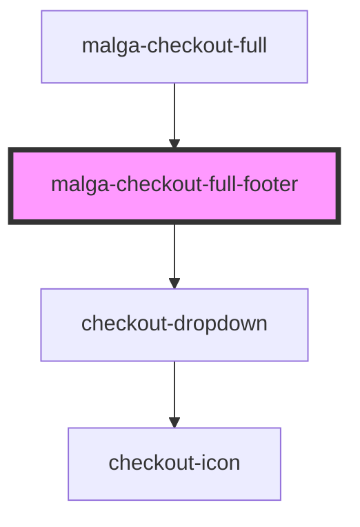

# malga-checkout-full-footer

<!-- Auto Generated Below -->

## Properties

| Property      | Attribute     | Description | Type     | Default     |
| ------------- | ------------- | ----------- | -------- | ----------- |
| `description` | `description` |             | `string` | `undefined` |
| `language`    | `language`    |             | `string` | `undefined` |

## Events

| Event            | Description | Type                              |
| ---------------- | ----------- | --------------------------------- |
| `changeLanguage` |             | `CustomEvent<{ value: Locale; }>` |

## Dependencies

### Used by

 - [malga-checkout-full](../..)

### Depends on

- checkout-dropdown

### Graph

----------------------------------------------

*Built with [StencilJS](https://stenciljs.com/)*
