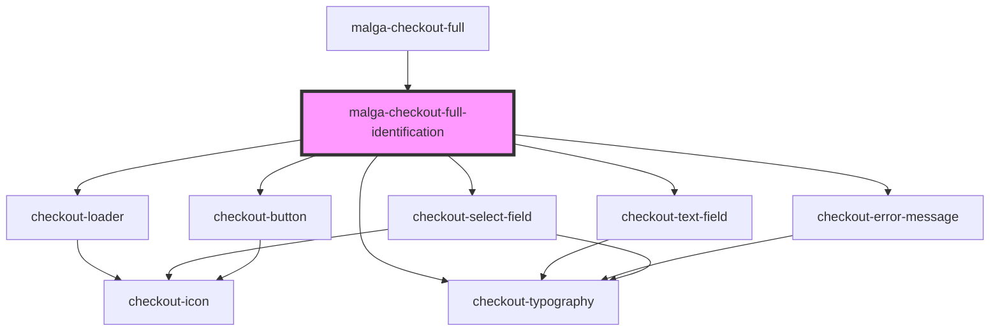

# malga-checkout-full-identification

<!-- Auto Generated Below -->

## Properties

| Property                | Attribute                | Description | Type                                                                    | Default     |
| ----------------------- | ------------------------ | ----------- | ----------------------------------------------------------------------- | ----------- |
| `formValues`            | --                       |             | `MalgaCheckoutFullIdentificationFormValues`                             | `undefined` |
| `internationalCustomer` | `international-customer` |             | `boolean`                                                               | `undefined` |
| `isLoading`             | `is-loading`             |             | `boolean`                                                               | `false`     |
| `locale`                | `locale`                 |             | `"default" \| "en" \| "en-US" \| "en_US" \| "pt" \| "pt-BR" \| "pt_BR"` | `undefined` |

## Events

| Event              | Description | Type                                                                              |
| ------------------ | ----------- | --------------------------------------------------------------------------------- |
| `fieldChange`      |             | `CustomEvent<{ field: string; value: string; }>`                                  |
| `manyFieldsChange` |             | `CustomEvent<{ customerFormValues: MalgaCheckoutFullIdentificationFormValues; }>` |
| `submitForm`       |             | `CustomEvent<void>`                                                               |

## Dependencies

### Used by

 - [malga-checkout-full](../..)

### Depends on

- checkout-loader
- checkout-typography
- checkout-text-field
- checkout-error-message
- checkout-select-field
- checkout-button

### Graph

----------------------------------------------

*Built with [StencilJS](https://stenciljs.com/)*
