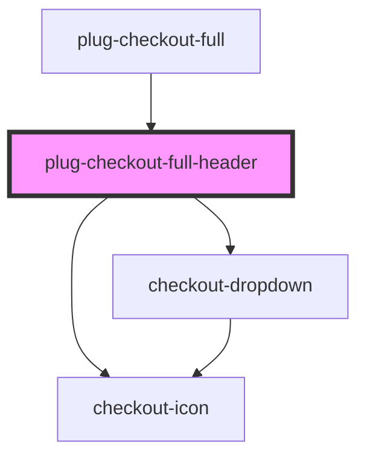

# plug-checkout-full-header

<!-- Auto Generated Below -->

## Properties

| Property    | Attribute    | Description | Type                                                                    | Default     |
| ----------- | ------------ | ----------- | ----------------------------------------------------------------------- | ----------- |
| `backRoute` | `back-route` |             | `string`                                                                | `undefined` |
| `brand`     | `brand`      |             | `string`                                                                | `undefined` |
| `isLoading` | `is-loading` |             | `boolean`                                                               | `false`     |
| `language`  | `language`   |             | `string`                                                                | `undefined` |
| `locale`    | `locale`     |             | `"default" \| "en" \| "en-US" \| "en_US" \| "pt" \| "pt-BR" \| "pt_BR"` | `undefined` |

## Events

| Event            | Description | Type                              |
| ---------------- | ----------- | --------------------------------- |
| `changeLanguage` |             | `CustomEvent<{ value: Locale; }>` |

## Dependencies

### Used by

 - [plug-checkout-full](../..)

### Depends on

- checkout-icon
- checkout-dropdown

### Graph

----------------------------------------------

*Built with [StencilJS](https://stenciljs.com/)*
