# plug-checkout-full

<!-- Auto Generated Below -->

## Properties

| Property            | Attribute     | Description | Type                             | Default                                                                                                                                                                            |
| ------------------- | ------------- | ----------- | -------------------------------- | ---------------------------------------------------------------------------------------------------------------------------------------------------------------------------------- |
| `clientId`          | `client-id`   |             | `string`                         | `undefined`                                                                                                                                                                        |
| `dialogConfig`      | --            |             | `PlugCheckoutFullDialog`         | `{     show: true,     actionButtonLabel: 'Continuar',     successActionButtonLabel: 'Continuar',     errorActionButtonLabel: 'Tentar Novamente',     successRedirectUrl: '',   }` |
| `merchantId`        | `merchant-id` |             | `string`                         | `undefined`                                                                                                                                                                        |
| `pageConfig`        | --            |             | `PlugCheckoutFullPage`           | `{     brandUrl: '',     footerDescription: '',     backRoute: '',     delivery: 0,     products: [],   }`                                                                         |
| `paymentMethods`    | --            |             | `PlugCheckoutFullPaymentMethods` | `{     pix: undefined,     credit: undefined,     boleto: undefined,   }`                                                                                                          |
| `publicKey`         | `public-key`  |             | `string`                         | `undefined`                                                                                                                                                                        |
| `sandbox`           | `sandbox`     |             | `boolean`                        | `false`                                                                                                                                                                            |
| `transactionConfig` | --            |             | `PlugCheckoutFullTransaction`    | `{     statementDescriptor: '',     amount: 0,     description: '',     orderId: '',     customerId: '',     currency: 'BRL',     capture: false,   }`                             |

## Events

| Event                | Description | Type                                                    |
| -------------------- | ----------- | ------------------------------------------------------- |
| `transactionFailed`  |             | `CustomEvent<{ error: PlugCheckoutFullChargeError; }>`  |
| `transactionSuccess` |             | `CustomEvent<{ data: PlugCheckoutFullChargeSuccess; }>` |

## Dependencies

### Depends on

- [plug-checkout-full-header](./partials/plug-checkout-full-header)
- [plug-checkout-full-content](./partials/plug-checkout-full-content)
- checkout-order-summary
- checkout-accordion
- [plug-checkout-full-identification](./partials/plug-checkout-full-identification)
- checkout-icon
- plug-checkout
- [plug-checkout-full-footer](./partials/plug-checkout-full-footer)

### Graph

```mermaid
graph TD;
  plug-checkout-full --> plug-checkout-full-header
  plug-checkout-full --> plug-checkout-full-content
  plug-checkout-full --> checkout-order-summary
  plug-checkout-full --> checkout-accordion
  plug-checkout-full --> plug-checkout-full-identification
  plug-checkout-full --> checkout-icon
  plug-checkout-full --> plug-checkout
  plug-checkout-full --> plug-checkout-full-footer
  plug-checkout-full-header --> checkout-icon
  checkout-order-summary --> checkout-typography
  checkout-order-summary --> checkout-icon
  checkout-accordion --> checkout-icon
  plug-checkout-full-identification --> checkout-typography
  plug-checkout-full-identification --> checkout-text-field
  plug-checkout-full-identification --> checkout-error-message
  plug-checkout-full-identification --> checkout-select-field
  plug-checkout-full-identification --> checkout-button
  checkout-text-field --> checkout-typography
  checkout-text-field --> checkout-icon
  checkout-error-message --> checkout-typography
  checkout-select-field --> checkout-typography
  checkout-select-field --> checkout-icon
  checkout-button --> checkout-icon
  plug-checkout --> plug-payments
  plug-checkout --> plug-payments-boleto
  plug-checkout --> plug-payments-pix
  plug-checkout --> plug-payments-credit
  plug-payments --> checkout-radio-field
  plug-payments --> plug-payments-boleto
  plug-payments --> plug-payments-pix
  plug-payments --> plug-payments-credit
  checkout-radio-field --> checkout-icon
  plug-payments-boleto --> checkout-manual-payment
  plug-payments-boleto --> checkout-modal
  checkout-manual-payment --> checkout-typography
  checkout-manual-payment --> checkout-button
  checkout-manual-payment --> checkout-icon
  checkout-modal --> checkout-modal-success
  checkout-modal --> checkout-modal-error
  checkout-modal --> checkout-modal-pix
  checkout-modal --> checkout-modal-boleto
  checkout-modal-success --> checkout-icon
  checkout-modal-success --> checkout-typography
  checkout-modal-success --> checkout-button
  checkout-modal-error --> checkout-icon
  checkout-modal-error --> checkout-typography
  checkout-modal-error --> checkout-button
  checkout-modal-pix --> checkout-icon
  checkout-modal-pix --> checkout-typography
  checkout-modal-pix --> checkout-clipboard-button
  checkout-modal-pix --> checkout-countdown
  checkout-modal-pix --> checkout-button
  checkout-clipboard-button --> checkout-icon
  checkout-clipboard-button --> checkout-typography
  checkout-countdown --> checkout-typography
  checkout-modal-boleto --> checkout-icon
  checkout-modal-boleto --> checkout-typography
  checkout-modal-boleto --> checkout-clipboard-button
  checkout-modal-boleto --> checkout-button
  plug-payments-pix --> checkout-manual-payment
  plug-payments-pix --> checkout-modal
  plug-payments-credit --> checkout-credit-card
  plug-payments-credit --> plug-payments-credit-form
  plug-payments-credit --> checkout-modal
  plug-payments-credit-form --> checkout-text-field
  plug-payments-credit-form --> checkout-error-message
  plug-payments-credit-form --> checkout-select-field
  plug-payments-credit-form --> checkout-button
  plug-payments-credit-form --> checkout-icon
  style plug-checkout-full fill:#f9f,stroke:#333,stroke-width:4px
```

----------------------------------------------

*Built with [StencilJS](https://stenciljs.com/)*
