# plug-checkout-full

<!-- Auto Generated Below -->

## Properties

| Property                   | Attribute                    | Description | Type                                                                         | Default                     |
| -------------------------- | ---------------------------- | ----------- | ---------------------------------------------------------------------------- | --------------------------- |
| `amount`                   | `amount`                     |             | `number`                                                                     | `undefined`                 |
| `boleto`                   | --                           |             | `BoletoAttributes`                                                           | `undefined`                 |
| `brandUrl`                 | `brand-url`                  |             | `string`                                                                     | `undefined`                 |
| `capture`                  | `capture`                    |             | `boolean`                                                                    | `false`                     |
| `clientId`                 | `client-id`                  |             | `string`                                                                     | `undefined`                 |
| `currency`                 | `currency`                   |             | `string`                                                                     | `'BRL'`                     |
| `customer`                 | --                           |             | `Customer`                                                                   | `undefined`                 |
| `customerId`               | `customer-id`                |             | `string`                                                                     | `undefined`                 |
| `delivery`                 | `delivery`                   |             | `number`                                                                     | `undefined`                 |
| `description`              | `description`                |             | `string`                                                                     | `undefined`                 |
| `footerDescription`        | `footer-description`         |             | `string`                                                                     | `undefined`                 |
| `hasIdentificationSection` | `has-identification-section` |             | `boolean`                                                                    | `true`                      |
| `installments`             | --                           |             | `PlugPaymentsCreditInstallmentsConfig`                                       | `undefined`                 |
| `merchantId`               | `merchant-id`                |             | `string`                                                                     | `undefined`                 |
| `orderId`                  | `order-id`                   |             | `string`                                                                     | `undefined`                 |
| `paymentMethods`           | --                           |             | `PaymentMethodsType[]`                                                       | `['card', 'pix', 'boleto']` |
| `pix`                      | --                           |             | `PixAttributes`                                                              | `undefined`                 |
| `products`                 | --                           |             | `{ name: string; amount: number; quantity: number; description: string; }[]` | `undefined`                 |
| `publicKey`                | `public-key`                 |             | `string`                                                                     | `undefined`                 |
| `sandbox`                  | `sandbox`                    |             | `boolean`                                                                    | `false`                     |
| `showCreditCard`           | `show-credit-card`           |             | `boolean`                                                                    | `false`                     |
| `statementDescriptor`      | `statement-descriptor`       |             | `string`                                                                     | `undefined`                 |

## Events

| Event            | Description | Type                                                |
| ---------------- | ----------- | --------------------------------------------------- |
| `paymentFailed`  |             | `CustomEvent<{ error: PlugPaymentsChargeError; }>`  |
| `paymentSuccess` |             | `CustomEvent<{ data: PlugPaymentsChargeSuccess; }>` |

## Dependencies

### Depends on

- [plug-checkout-full-header](./partials/plug-checkout-full-header)
- [plug-checkout-full-content](./partials/plug-checkout-full-content)
- checkout-order-summary
- checkout-accordion
- [plug-checkout-full-identification](./partials/plug-checkout-full-identification)
- [plug-checkout](../plug-checkout)
- [plug-checkout-full-footer](./partials/plug-checkout-full-footer)

### Graph

```mermaid
graph TD;
  plug-checkout-full --> plug-checkout-full-header
  plug-checkout-full --> plug-checkout-full-content
  plug-checkout-full --> checkout-order-summary
  plug-checkout-full --> checkout-accordion
  plug-checkout-full --> plug-checkout-full-identification
  plug-checkout-full --> plug-checkout
  plug-checkout-full --> plug-checkout-full-footer
  plug-checkout-full-header --> checkout-icon
  checkout-order-summary --> checkout-typography
  checkout-order-summary --> checkout-icon
  checkout-accordion --> checkout-icon
  plug-checkout-full-identification --> checkout-typography
  plug-checkout-full-identification --> checkout-text-field
  plug-checkout-full-identification --> checkout-error-message
  plug-checkout-full-identification --> checkout-select-field
  plug-checkout-full-identification --> checkout-button
  checkout-text-field --> checkout-typography
  checkout-text-field --> checkout-icon
  checkout-error-message --> checkout-typography
  checkout-select-field --> checkout-typography
  checkout-select-field --> checkout-icon
  checkout-button --> checkout-icon
  plug-checkout --> plug-payments
  plug-checkout --> plug-payments-boleto
  plug-checkout --> plug-payments-pix
  plug-checkout --> plug-payments-credit
  plug-payments --> checkout-radio-field
  plug-payments --> plug-payments-boleto
  plug-payments --> plug-payments-pix
  plug-payments --> plug-payments-credit
  plug-payments-boleto --> checkout-manual-payment
  plug-payments-boleto --> checkout-modal
  checkout-manual-payment --> checkout-typography
  checkout-manual-payment --> checkout-button
  checkout-manual-payment --> checkout-icon
  checkout-modal --> checkout-modal-success
  checkout-modal --> checkout-modal-error
  checkout-modal --> checkout-modal-pix
  checkout-modal --> checkout-modal-boleto
  checkout-modal-success --> checkout-icon
  checkout-modal-success --> checkout-typography
  checkout-modal-success --> checkout-button
  checkout-modal-error --> checkout-icon
  checkout-modal-error --> checkout-typography
  checkout-modal-error --> checkout-button
  checkout-modal-pix --> checkout-icon
  checkout-modal-pix --> checkout-typography
  checkout-modal-pix --> checkout-clipboard-button
  checkout-modal-pix --> checkout-countdown
  checkout-clipboard-button --> checkout-icon
  checkout-clipboard-button --> checkout-typography
  checkout-countdown --> checkout-typography
  checkout-modal-boleto --> checkout-icon
  checkout-modal-boleto --> checkout-typography
  checkout-modal-boleto --> checkout-clipboard-button
  plug-payments-pix --> checkout-manual-payment
  plug-payments-pix --> checkout-modal
  plug-payments-credit --> checkout-credit-card
  plug-payments-credit --> plug-payments-credit-form
  plug-payments-credit --> checkout-modal
  plug-payments-credit-form --> checkout-text-field
  plug-payments-credit-form --> checkout-error-message
  plug-payments-credit-form --> checkout-select-field
  plug-payments-credit-form --> checkout-button
  plug-payments-credit-form --> checkout-icon
  style plug-checkout-full fill:#f9f,stroke:#333,stroke-width:4px
```

----------------------------------------------

*Built with [StencilJS](https://stenciljs.com/)*
