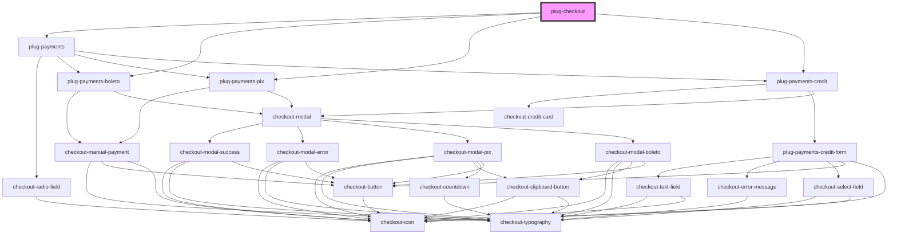

# plug-checkout

<!-- Auto Generated Below -->

## Properties

| Property            | Attribute     | Description | Type                         | Default                                                                                                                                                                    |
| ------------------- | ------------- | ----------- | ---------------------------- | -------------------------------------------------------------------------------------------------------------------------------------------------------------------------- |
| `clientId`          | `client-id`   |             | `string`                     | `undefined`                                                                                                                                                                |
| `dialogConfig`      | --            |             | `PlugCheckoutDialog`         | `{     show: true,     actionButtonLabel: 'Continuar',     successActionButtonLabel: 'Continuar',     errorActionButtonLabel: 'Tentar Novamente',   }`                     |
| `merchantId`        | `merchant-id` |             | `string`                     | `undefined`                                                                                                                                                                |
| `paymentMethods`    | --            |             | `PlugCheckoutPaymentMethods` | `{     pix: undefined,     credit: undefined,     boleto: undefined   }`                                                                                                   |
| `publicKey`         | `public-key`  |             | `string`                     | `undefined`                                                                                                                                                                |
| `sandbox`           | `sandbox`     |             | `boolean`                    | `false`                                                                                                                                                                    |
| `transactionConfig` | --            |             | `PlugCheckoutTransaction`    | `{     statementDescriptor: '',     amount: 0,     description: '',     orderId: '',     customerId: '',     currency: 'BRL',     capture: false,     customer: null,   }` |

## Events

| Event            | Description | Type                                                |
| ---------------- | ----------- | --------------------------------------------------- |
| `paymentFailed`  |             | `CustomEvent<{ error: PlugPaymentsChargeError; }>`  |
| `paymentSuccess` |             | `CustomEvent<{ data: PlugPaymentsChargeSuccess; }>` |

## Dependencies

### Depends on

- [plug-payments](../plug-payments)
- [plug-payments-boleto](../plug-payments-boleto)
- [plug-payments-pix](../plug-payments-pix)
- [plug-payments-credit](../plug-payments-credit)

### Graph

----------------------------------------------

*Built with [StencilJS](https://stenciljs.com/)*
