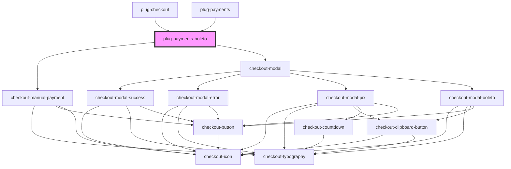

# plug-payments-boleto

<!-- Auto Generated Below -->

## Properties

| Property              | Attribute              | Description | Type               | Default     |
| --------------------- | ---------------------- | ----------- | ------------------ | ----------- |
| `amount`              | `amount`               |             | `number`           | `undefined` |
| `boleto`              | --                     |             | `BoletoAttributes` | `undefined` |
| `capture`             | `capture`              |             | `boolean`          | `false`     |
| `clientId`            | `client-id`            |             | `string`           | `undefined` |
| `currency`            | `currency`             |             | `string`           | `'BRL'`     |
| `customer`            | --                     |             | `Customer`         | `undefined` |
| `customerId`          | `customer-id`          |             | `string`           | `undefined` |
| `description`         | `description`          |             | `string`           | `undefined` |
| `merchantId`          | `merchant-id`          |             | `string`           | `undefined` |
| `orderId`             | `order-id`             |             | `string`           | `undefined` |
| `publicKey`           | `public-key`           |             | `string`           | `undefined` |
| `sandbox`             | `sandbox`              |             | `boolean`          | `false`     |
| `showDialog`          | `show-dialog`          |             | `boolean`          | `true`      |
| `statementDescriptor` | `statement-descriptor` |             | `string`           | `undefined` |

## Events

| Event            | Description | Type                                                      |
| ---------------- | ----------- | --------------------------------------------------------- |
| `paymentFailed`  |             | `CustomEvent<{ error: PlugPaymentsBoletoChargeError; }>`  |
| `paymentSuccess` |             | `CustomEvent<{ data: PlugPaymentsBoletoChargeSuccess; }>` |

## Dependencies

### Used by

 - [plug-checkout](../plug-checkout)
 - [plug-payments](../plug-payments)

### Depends on

- checkout-manual-payment
- checkout-modal

### Graph

----------------------------------------------

*Built with [StencilJS](https://stenciljs.com/)*
