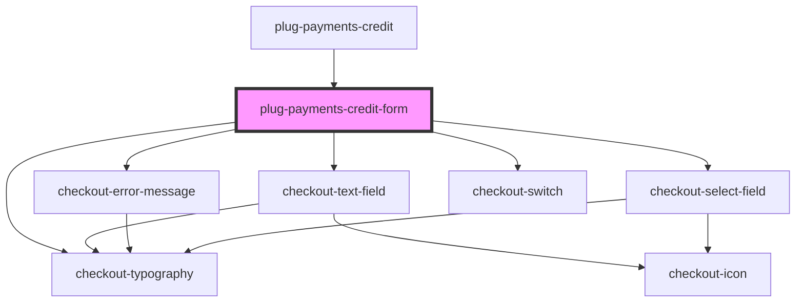

# plug-checkout-form

<!-- Auto Generated Below -->

## Events

| Event                | Description | Type                              |
| -------------------- | ----------- | --------------------------------- |
| `currentFieldChange` |             | `CustomEvent<{ field: string; }>` |

## Dependencies

### Used by

 - [plug-payments-credit](../..)

### Depends on

- checkout-text-field
- checkout-error-message
- checkout-select-field
- checkout-switch
- checkout-typography

### Graph

----------------------------------------------

*Built with [StencilJS](https://stenciljs.com/)*
