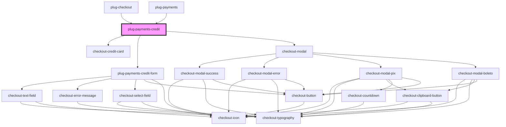

# plug-checkout

<!-- Auto Generated Below -->

## Properties

| Property                 | Attribute              | Description | Type                                           | Default                                  |
| ------------------------ | ---------------------- | ----------- | ---------------------------------------------- | ---------------------------------------- |
| `amount`                 | `amount`               |             | `number`                                       | `undefined`                              |
| `capture`                | `capture`              |             | `boolean`                                      | `false`                                  |
| `clientId`               | `client-id`            |             | `string`                                       | `undefined`                              |
| `currency`               | `currency`             |             | `string`                                       | `'BRL'`                                  |
| `customFormStyleClasses` | --                     |             | `PlugPaymentsCreditFormCustomStyleFormClasses` | `defaultCustomStyles`                    |
| `customer`               | --                     |             | `Customer`                                     | `undefined`                              |
| `customerId`             | `customer-id`          |             | `string`                                       | `undefined`                              |
| `description`            | `description`          |             | `string`                                       | `undefined`                              |
| `installmentsConfig`     | --                     |             | `PlugPaymentsCreditInstallmentsConfig`         | `{     show: true,     quantity: 1,   }` |
| `merchantId`             | `merchant-id`          |             | `string`                                       | `undefined`                              |
| `orderId`                | `order-id`             |             | `string`                                       | `undefined`                              |
| `publicKey`              | `public-key`           |             | `string`                                       | `undefined`                              |
| `sandbox`                | `sandbox`              |             | `boolean`                                      | `false`                                  |
| `showCreditCard`         | `show-credit-card`     |             | `boolean`                                      | `true`                                   |
| `showDialog`             | `show-dialog`          |             | `boolean`                                      | `true`                                   |
| `statementDescriptor`    | `statement-descriptor` |             | `string`                                       | `undefined`                              |

## Events

| Event                  | Description | Type                                                      |
| ---------------------- | ----------- | --------------------------------------------------------- |
| `creditPaymentFailed`  |             | `CustomEvent<{ error: PlugPaymentsCreditChargeError; }>`  |
| `creditPaymentSuccess` |             | `CustomEvent<{ data: PlugPaymentsCreditChargeSuccess; }>` |

## Dependencies

### Used by

 - [plug-checkout](../plug-checkout)
 - [plug-payments](../plug-payments)

### Depends on

- checkout-credit-card
- [plug-payments-credit-form](./partials/plug-payments-credit-form)
- checkout-modal

### Graph

----------------------------------------------

*Built with [StencilJS](https://stenciljs.com/)*
