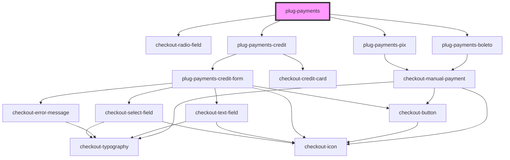

# plug-payments

<!-- Auto Generated Below -->

## Properties

| Property              | Attribute              | Description | Type                                   | Default                     |
| --------------------- | ---------------------- | ----------- | -------------------------------------- | --------------------------- |
| `amount`              | `amount`               |             | `number`                               | `undefined`                 |
| `boleto`              | --                     |             | `IBoleto`                              | `undefined`                 |
| `capture`             | `capture`              |             | `boolean`                              | `false`                     |
| `clientId`            | `client-id`            |             | `string`                               | `undefined`                 |
| `currency`            | `currency`             |             | `string`                               | `'BRL'`                     |
| `customer`            | --                     |             | `ICustomer`                            | `undefined`                 |
| `customerId`          | `customer-id`          |             | `string`                               | `undefined`                 |
| `description`         | `description`          |             | `string`                               | `undefined`                 |
| `installments`        | --                     |             | `PlugPaymentsCreditInstallmentsConfig` | `undefined`                 |
| `merchantId`          | `merchant-id`          |             | `string`                               | `undefined`                 |
| `orderId`             | `order-id`             |             | `string`                               | `undefined`                 |
| `paymentMethods`      | --                     |             | `PaymentMethodsType[]`                 | `['card', 'pix', 'boleto']` |
| `pix`                 | --                     |             | `IPix`                                 | `undefined`                 |
| `publicKey`           | `public-key`           |             | `string`                               | `undefined`                 |
| `sandbox`             | `sandbox`              |             | `boolean`                              | `false`                     |
| `showCreditCard`      | `show-credit-card`     |             | `boolean`                              | `false`                     |
| `statementDescriptor` | `statement-descriptor` |             | `string`                               | `undefined`                 |

## Events

| Event            | Description | Type                                                |
| ---------------- | ----------- | --------------------------------------------------- |
| `paymentFailed`  |             | `CustomEvent<{ error: PlugPaymentsChargeError; }>`  |
| `paymentSuccess` |             | `CustomEvent<{ data: PlugPaymentsChargeSuccess; }>` |

## Dependencies

### Depends on

- checkout-radio-field
- [plug-payments-boleto](../plug-payments-boleto)
- [plug-payments-pix](../plug-payments-pix)
- [plug-payments-credit](../plug-payments-credit)

### Graph

----------------------------------------------

*Built with [StencilJS](https://stenciljs.com/)*
