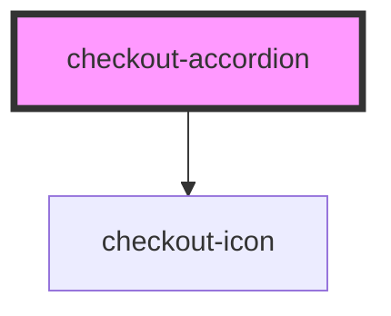

# checkout-accordion

<!-- Auto Generated Below -->

## Properties

| Property     | Attribute     | Description | Type      | Default     |
| ------------ | ------------- | ----------- | --------- | ----------- |
| `fullWidth`  | `full-width`  |             | `boolean` | `false`     |
| `isEditable` | `is-editable` |             | `boolean` | `undefined` |
| `label`      | `label`       |             | `string`  | `undefined` |
| `opened`     | `opened`      |             | `boolean` | `undefined` |

## Events

| Event         | Description | Type                |
| ------------- | ----------- | ------------------- |
| `expandClick` |             | `CustomEvent<void>` |

## Dependencies

### Depends on

- [checkout-icon](../checkout-icon)

### Graph

----------------------------------------------

*Built with [StencilJS](https://stenciljs.com/)*
