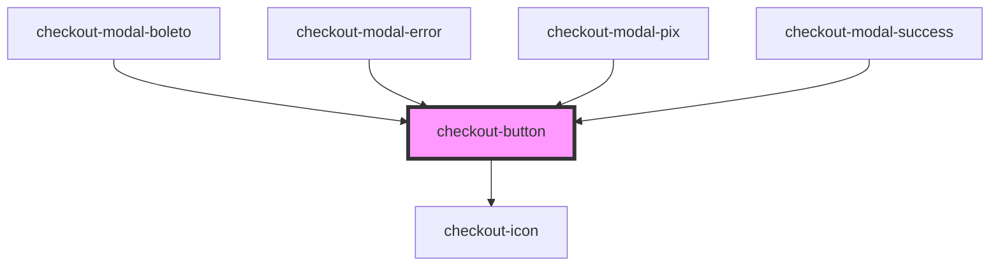

# checkout-button

<!-- Auto Generated Below -->

## Properties

| Property           | Attribute           | Description | Type                                                                                                                                                                                                                                                                                                                                                  | Default     |
| ------------------ | ------------------- | ----------- | ----------------------------------------------------------------------------------------------------------------------------------------------------------------------------------------------------------------------------------------------------------------------------------------------------------------------------------------------------- | ----------- |
| `clipboardContent` | `clipboard-content` |             | `string`                                                                                                                                                                                                                                                                                                                                              | `undefined` |
| `customClass`      | `custom-class`      |             | `string`                                                                                                                                                                                                                                                                                                                                              | `undefined` |
| `disabled`         | `disabled`          |             | `boolean`                                                                                                                                                                                                                                                                                                                                             | `false`     |
| `fullWidth`        | `full-width`        |             | `boolean`                                                                                                                                                                                                                                                                                                                                             | `undefined` |
| `icon`             | `icon`              |             | `"arrowDown" \| "calendar" \| "check" \| "creditCard" \| "cvv" \| "dollar" \| "lock" \| "spinner" \| "user" \| "warning" \| "poweredByPlug" \| "edit" \| "eye" \| "eyeSlash" \| "arrowLeft" \| "error" \| "checkLarge" \| "clipboard" \| "pix" \| "newTab" \| "amex" \| "dinersclub" \| "discover" \| "elo" \| "hipercard" \| "mastercard" \| "visa"` | `undefined` |
| `isLoading`        | `is-loading`        |             | `boolean`                                                                                                                                                                                                                                                                                                                                             | `undefined` |
| `label`            | `label`             |             | `string`                                                                                                                                                                                                                                                                                                                                              | `undefined` |
| `locale`           | `locale`            |             | `"default" \| "en" \| "en-US" \| "en_US" \| "pt" \| "pt-BR" \| "pt_BR"`                                                                                                                                                                                                                                                                               | `undefined` |
| `type`             | `type`              |             | `"button" \| "reset" \| "submit"`                                                                                                                                                                                                                                                                                                                     | `'button'`  |

## Events

| Event     | Description | Type                |
| --------- | ----------- | ------------------- |
| `blured`  |             | `CustomEvent<void>` |
| `clicked` |             | `CustomEvent<void>` |
| `focused` |             | `CustomEvent<void>` |

## Dependencies

### Used by

 - [checkout-modal-boleto](../checkout-modal/partials/checkout-modal-boleto)
 - [checkout-modal-error](../checkout-modal/partials/checkout-modal-error)
 - [checkout-modal-pix](../checkout-modal/partials/checkout-modal-pix)
 - [checkout-modal-success](../checkout-modal/partials/checkout-modal-success)

### Depends on

- [checkout-icon](../checkout-icon)

### Graph

----------------------------------------------

*Built with [StencilJS](https://stenciljs.com/)*
