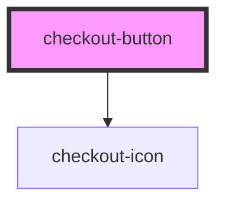

# checkout-button

<!-- Auto Generated Below -->

## Properties

| Property      | Attribute      | Description | Type                                                                                                                      | Default     |
| ------------- | -------------- | ----------- | ------------------------------------------------------------------------------------------------------------------------- | ----------- |
| `customClass` | `custom-class` |             | `string`                                                                                                                  | `undefined` |
| `disabled`    | `disabled`     |             | `boolean`                                                                                                                 | `false`     |
| `fullWidth`   | `full-width`   |             | `boolean`                                                                                                                 | `undefined` |
| `icon`        | `icon`         |             | `"arrowDown" \| "calendar" \| "check" \| "creditCard" \| "cvv" \| "dollar" \| "lock" \| "spinner" \| "user" \| "warning"` | `undefined` |
| `isLoading`   | `is-loading`   |             | `boolean`                                                                                                                 | `undefined` |
| `label`       | `label`        |             | `string`                                                                                                                  | `undefined` |
| `type`        | `type`         |             | `"button" \| "reset" \| "submit"`                                                                                         | `'button'`  |

## Events

| Event     | Description | Type                |
| --------- | ----------- | ------------------- |
| `blured`  |             | `CustomEvent<void>` |
| `clicked` |             | `CustomEvent<void>` |
| `focused` |             | `CustomEvent<void>` |

## Dependencies

### Depends on

- [checkout-icon](../checkout-icon)

### Graph

----------------------------------------------

*Built with [StencilJS](https://stenciljs.com/)*
