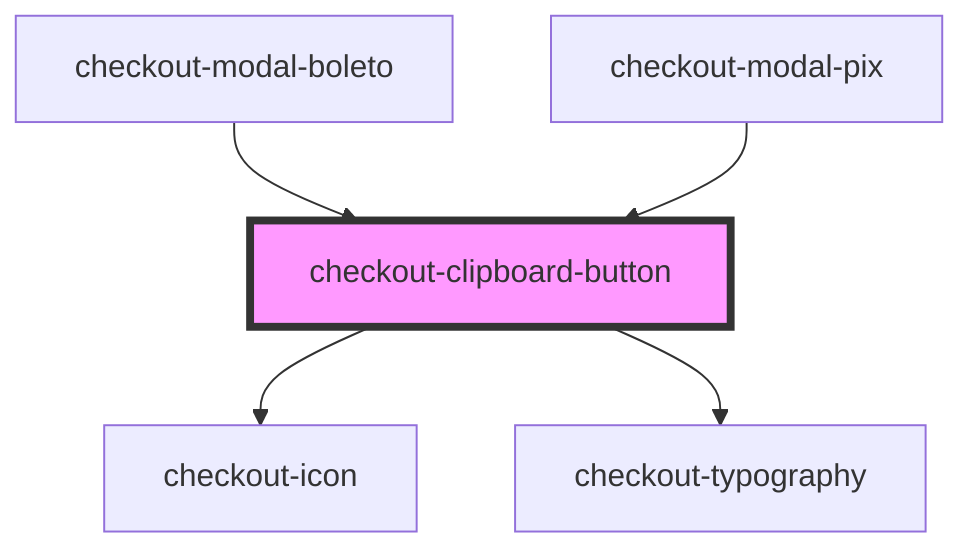

# checkout-clipboard-button

<!-- Auto Generated Below -->

## Properties

| Property           | Attribute           | Description | Type     | Default     |
| ------------------ | ------------------- | ----------- | -------- | ----------- |
| `clipboardContent` | `clipboard-content` |             | `string` | `undefined` |
| `label`            | `label`             |             | `string` | `undefined` |

## Dependencies

### Used by

 - [checkout-modal-boleto](../checkout-modal/partials/checkout-modal-boleto)
 - [checkout-modal-pix](../checkout-modal/partials/checkout-modal-pix)

### Depends on

- [checkout-icon](../checkout-icon)
- [checkout-typography](../checkout-typography)

### Graph

----------------------------------------------

*Built with [StencilJS](https://stenciljs.com/)*
