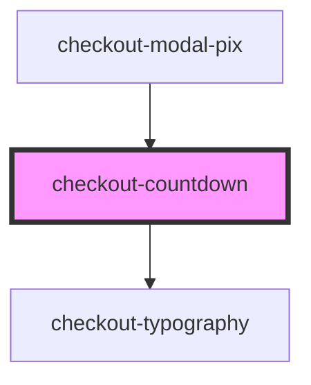

# checkout-countdown

<!-- Auto Generated Below -->

## Properties

| Property                 | Attribute                   | Description | Type     | Default     |
| ------------------------ | --------------------------- | ----------- | -------- | ----------- |
| `emptyProgressBarColor`  | `empty-progress-bar-color`  |             | `string` | `'#D8DFF0'` |
| `expirationTime`         | `expiration-time`           |             | `number` | `undefined` |
| `filledProgressBarColor` | `filled-progress-bar-color` |             | `string` | `'#344383'` |

## Dependencies

### Used by

 - [checkout-modal-pix](../checkout-modal/partials/checkout-modal-pix)

### Depends on

- [checkout-typography](../checkout-typography)

### Graph

----------------------------------------------

*Built with [StencilJS](https://stenciljs.com/)*
