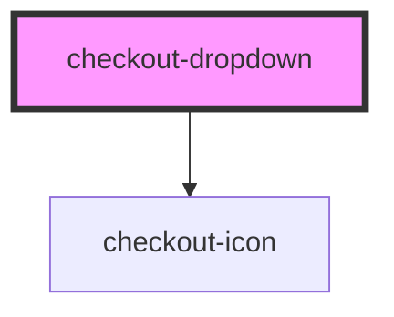

# checkout-dropdown

<!-- Auto Generated Below -->

## Properties

| Property    | Attribute    | Description | Type                                                                                                                                                                                                                                                                                                                                                                                   | Default       |
| ----------- | ------------ | ----------- | -------------------------------------------------------------------------------------------------------------------------------------------------------------------------------------------------------------------------------------------------------------------------------------------------------------------------------------------------------------------------------------- | ------------- |
| `endIcon`   | `end-icon`   |             | `"arrowDown" \| "calendar" \| "check" \| "creditCard" \| "cvv" \| "dollar" \| "lock" \| "spinner" \| "user" \| "warning" \| "poweredByMalga" \| "edit" \| "eye" \| "eyeSlash" \| "arrowLeft" \| "error" \| "checkLarge" \| "clipboard" \| "pix" \| "newTab" \| "amex" \| "dinersclub" \| "discover" \| "elo" \| "hipercard" \| "mastercard" \| "visa" \| "globe" \| "drip" \| "close"` | `'arrowDown'` |
| `fullWidth` | `full-width` |             | `boolean`                                                                                                                                                                                                                                                                                                                                                                              | `false`       |
| `label`     | `label`      |             | `string`                                                                                                                                                                                                                                                                                                                                                                               | `undefined`   |
| `options`   | --           |             | `CheckoutDropdownOptions[]`                                                                                                                                                                                                                                                                                                                                                            | `undefined`   |
| `startIcon` | `start-icon` |             | `"arrowDown" \| "calendar" \| "check" \| "creditCard" \| "cvv" \| "dollar" \| "lock" \| "spinner" \| "user" \| "warning" \| "poweredByMalga" \| "edit" \| "eye" \| "eyeSlash" \| "arrowLeft" \| "error" \| "checkLarge" \| "clipboard" \| "pix" \| "newTab" \| "amex" \| "dinersclub" \| "discover" \| "elo" \| "hipercard" \| "mastercard" \| "visa" \| "globe" \| "drip" \| "close"` | `undefined`   |
| `value`     | `value`      |             | `string`                                                                                                                                                                                                                                                                                                                                                                               | `undefined`   |

## Events

| Event     | Description | Type                              |
| --------- | ----------- | --------------------------------- |
| `changed` |             | `CustomEvent<{ value: string; }>` |

## Dependencies

### Depends on

- [checkout-icon](../checkout-icon)

### Graph

----------------------------------------------

*Built with [StencilJS](https://stenciljs.com/)*
