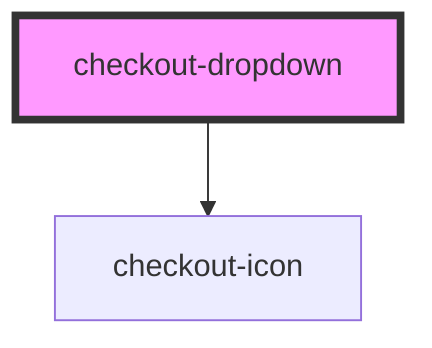

# checkout-dropdown

<!-- Auto Generated Below -->

## Properties

| Property    | Attribute    | Description | Type                        | Default     |
| ----------- | ------------ | ----------- | --------------------------- | ----------- |
| `fullWidth` | `full-width` |             | `boolean`                   | `false`     |
| `label`     | `label`      |             | `string`                    | `undefined` |
| `options`   | --           |             | `CheckoutDropdownOptions[]` | `undefined` |
| `value`     | `value`      |             | `string`                    | `undefined` |

## Events

| Event     | Description | Type                              |
| --------- | ----------- | --------------------------------- |
| `changed` |             | `CustomEvent<{ value: string; }>` |

## Dependencies

### Depends on

- [checkout-icon](../checkout-icon)

### Graph

----------------------------------------------

*Built with [StencilJS](https://stenciljs.com/)*
