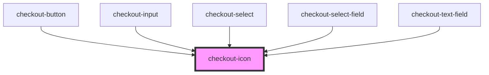

# checkout-icon

<!-- Auto Generated Below -->

## Properties

| Property | Attribute | Description | Type                                                                                                                      | Default     |
| -------- | --------- | ----------- | ------------------------------------------------------------------------------------------------------------------------- | ----------- |
| `class`  | `class`   |             | `string`                                                                                                                  | `undefined` |
| `icon`   | `icon`    |             | `"arrowDown" \| "calendar" \| "check" \| "creditCard" \| "cvv" \| "dollar" \| "lock" \| "spinner" \| "user" \| "warning"` | `undefined` |

## Dependencies

### Used by

 - [checkout-button](../checkout-button)
 - [checkout-input](../checkout-input)
 - [checkout-select](../checkout-select)
 - [checkout-select-field](../checkout-select-field)
 - [checkout-text-field](../checkout-text-field)

### Graph

----------------------------------------------

*Built with [StencilJS](https://stenciljs.com/)*
