# checkout-icon

<!-- Auto Generated Below -->

## Properties

| Property | Attribute | Description | Type                                                                                                                                                                                                                                                                                                                                                  | Default     |
| -------- | --------- | ----------- | ----------------------------------------------------------------------------------------------------------------------------------------------------------------------------------------------------------------------------------------------------------------------------------------------------------------------------------------------------- | ----------- |
| `class`  | `class`   |             | `string`                                                                                                                                                                                                                                                                                                                                              | `undefined` |
| `icon`   | `icon`    |             | `"arrowDown" \| "calendar" \| "check" \| "creditCard" \| "cvv" \| "dollar" \| "lock" \| "spinner" \| "user" \| "warning" \| "poweredByPlug" \| "edit" \| "eye" \| "eyeSlash" \| "arrowLeft" \| "error" \| "checkLarge" \| "clipboard" \| "pix" \| "newTab" \| "amex" \| "dinersclub" \| "discover" \| "elo" \| "hipercard" \| "mastercard" \| "visa"` | `undefined` |

## Dependencies

### Used by

 - [checkout-accordion](../checkout-accordion)
 - [checkout-button](../checkout-button)
 - [checkout-clipboard-button](../checkout-clipboard-button)
 - [checkout-loader](../checkout-loader)
 - [checkout-modal-boleto](../checkout-modal/partials/checkout-modal-boleto)
 - [checkout-modal-error](../checkout-modal/partials/checkout-modal-error)
 - [checkout-modal-pix](../checkout-modal/partials/checkout-modal-pix)
 - [checkout-modal-success](../checkout-modal/partials/checkout-modal-success)
 - [checkout-order-summary](../checkout-order-summary)
 - [checkout-radio-field](../checkout-radio-field)
 - [checkout-select-field](../checkout-select-field)
 - [checkout-text-field](../checkout-text-field)

### Graph

```mermaid
graph TD;
  checkout-accordion --> checkout-icon
  checkout-button --> checkout-icon
  checkout-clipboard-button --> checkout-icon
  checkout-loader --> checkout-icon
  checkout-modal-boleto --> checkout-icon
  checkout-modal-error --> checkout-icon
  checkout-modal-pix --> checkout-icon
  checkout-modal-success --> checkout-icon
  checkout-order-summary --> checkout-icon
  checkout-radio-field --> checkout-icon
  checkout-select-field --> checkout-icon
  checkout-text-field --> checkout-icon
  style checkout-icon fill:#f9f,stroke:#333,stroke-width:4px
```

----------------------------------------------

*Built with [StencilJS](https://stenciljs.com/)*
