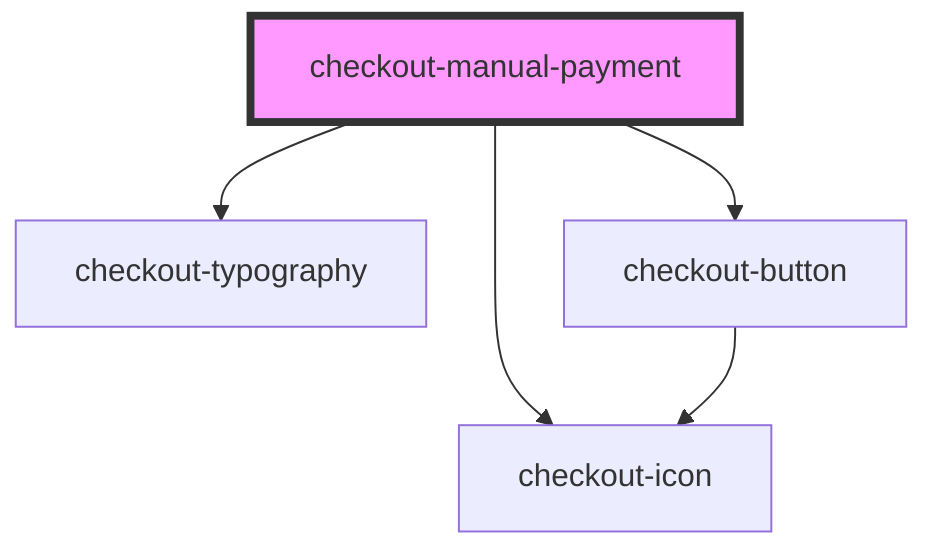

# checkout-manual-payment

<!-- Auto Generated Below -->

## Properties

| Property        | Attribute        | Description | Type                                  | Default |
| --------------- | ---------------- | ----------- | ------------------------------------- | ------- |
| `paymentMethod` | `payment-method` |             | `"boleto" \| "pix" \| "pixWithTimer"` | `'pix'` |

## Events

| Event          | Description | Type                |
| -------------- | ----------- | ------------------- |
| `paymentClick` |             | `CustomEvent<void>` |

## Dependencies

### Depends on

- [checkout-typography](../checkout-typography)
- [checkout-button](../checkout-button)
- [checkout-icon](../checkout-icon)

### Graph

----------------------------------------------

*Built with [StencilJS](https://stenciljs.com/)*
