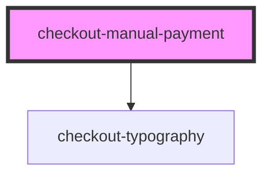

# checkout-manual-payment

<!-- Auto Generated Below -->

## Properties

| Property        | Attribute        | Description | Type                                                                    | Default     |
| --------------- | ---------------- | ----------- | ----------------------------------------------------------------------- | ----------- |
| `fullWidth`     | `full-width`     |             | `boolean`                                                               | `undefined` |
| `locale`        | `locale`         |             | `"default" \| "en" \| "en-US" \| "en_US" \| "pt" \| "pt-BR" \| "pt_BR"` | `undefined` |
| `paymentMethod` | `payment-method` |             | `"boleto" \| "pix" \| "pixWithTimer"`                                   | `'pix'`     |

## Dependencies

### Depends on

- [checkout-typography](../checkout-typography)

### Graph

----------------------------------------------

*Built with [StencilJS](https://stenciljs.com/)*
