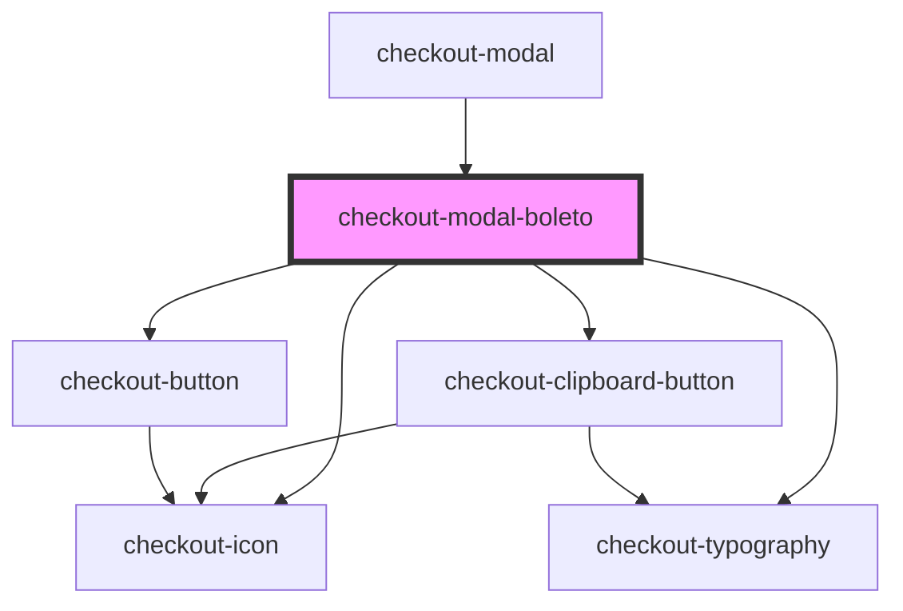

# checkout-modal-boleto

<!-- Auto Generated Below -->

## Properties

| Property                | Attribute                 | Description | Type     | Default                          |
| ----------------------- | ------------------------- | ----------- | -------- | -------------------------------- |
| `actionButtonLabel`     | `action-button-label`     |             | `string` | `'Continuar'`                    |
| `amount`                | `amount`                  |             | `number` | `undefined`                      |
| `boletoCode`            | `boleto-code`             |             | `string` | `undefined`                      |
| `boletoImageUrl`        | `boleto-image-url`        |             | `string` | `undefined`                      |
| `expirationDate`        | `expiration-date`         |             | `string` | `undefined`                      |
| `waitingPaymentMessage` | `waiting-payment-message` |             | `string` | `'Pedido aguardando pagamento!'` |

## Events

| Event                         | Description | Type                |
| ----------------------------- | ----------- | ------------------- |
| `boletoActionButtonIsClicked` |             | `CustomEvent<void>` |

## Dependencies

### Used by

 - [checkout-modal](../..)

### Depends on

- [checkout-icon](../../../checkout-icon)
- [checkout-typography](../../../checkout-typography)
- [checkout-clipboard-button](../../../checkout-clipboard-button)
- [checkout-button](../../../checkout-button)

### Graph

----------------------------------------------

*Built with [StencilJS](https://stenciljs.com/)*
