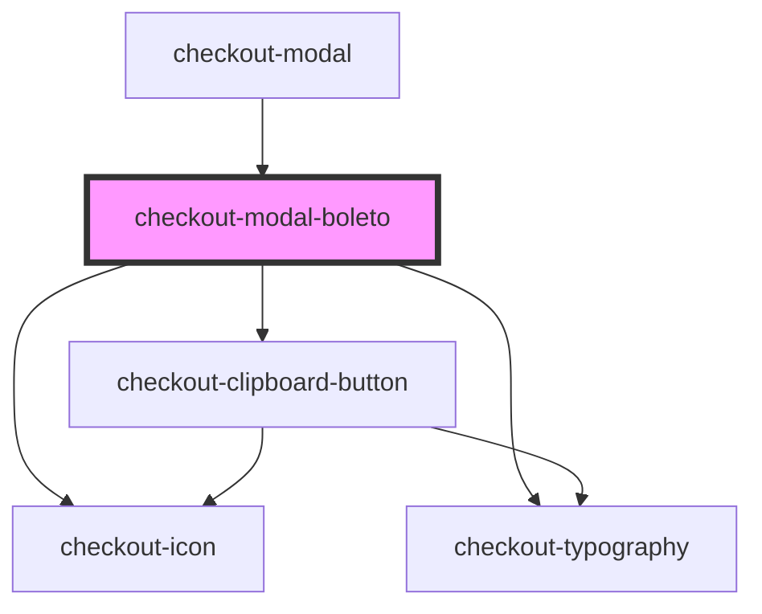

# checkout-modal-boleto

<!-- Auto Generated Below -->

## Properties

| Property         | Attribute          | Description | Type     | Default     |
| ---------------- | ------------------ | ----------- | -------- | ----------- |
| `amount`         | `amount`           |             | `number` | `undefined` |
| `boletoCode`     | `boleto-code`      |             | `string` | `undefined` |
| `boletoImageUrl` | `boleto-image-url` |             | `string` | `undefined` |
| `expirationDate` | `expiration-date`  |             | `string` | `undefined` |

## Dependencies

### Used by

 - [checkout-modal](../..)

### Depends on

- [checkout-icon](../../../checkout-icon)
- [checkout-typography](../../../checkout-typography)
- [checkout-clipboard-button](../../../checkout-clipboard-button)

### Graph

----------------------------------------------

*Built with [StencilJS](https://stenciljs.com/)*
