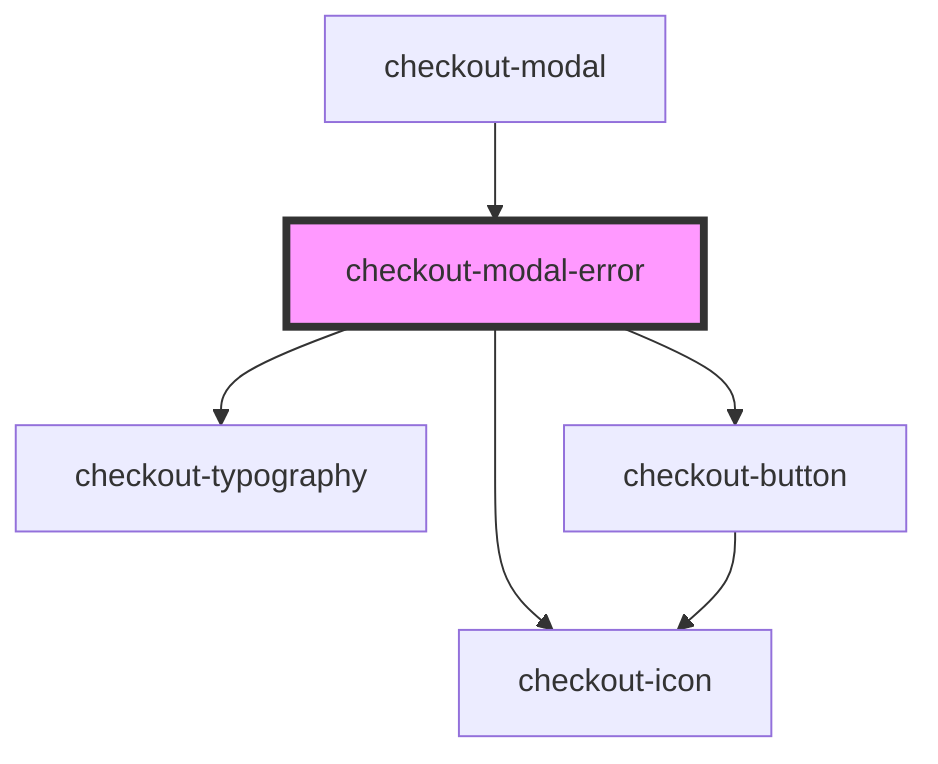

# checkout-modal-error

<!-- Auto Generated Below -->

## Properties

| Property           | Attribute           | Description | Type     | Default     |
| ------------------ | ------------------- | ----------- | -------- | ----------- |
| `errorDescription` | `error-description` |             | `string` | `undefined` |
| `errorTitle`       | `error-title`       |             | `string` | `undefined` |

## Events

| Event                | Description | Type                |
| -------------------- | ----------- | ------------------- |
| `errorButtonClicked` |             | `CustomEvent<void>` |

## Dependencies

### Used by

 - [checkout-modal](../..)

### Depends on

- [checkout-icon](../../../checkout-icon)
- [checkout-typography](../../../checkout-typography)
- [checkout-button](../../../checkout-button)

### Graph

----------------------------------------------

*Built with [StencilJS](https://stenciljs.com/)*
