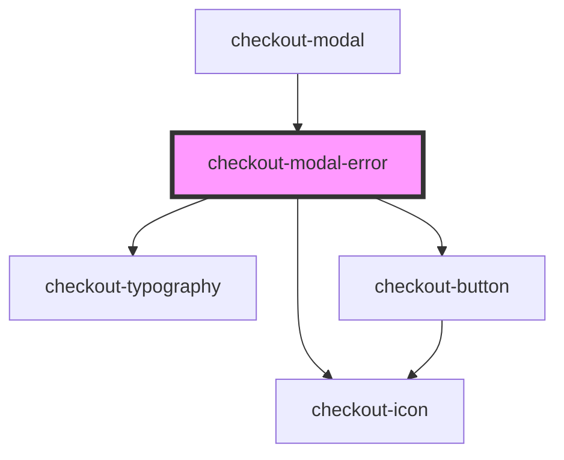

# checkout-modal-error

<!-- Auto Generated Below -->

## Properties

| Property                 | Attribute                   | Description | Type     | Default              |
| ------------------------ | --------------------------- | ----------- | -------- | -------------------- |
| `errorActionButtonLabel` | `error-action-button-label` |             | `string` | `'Tentar Novamente'` |
| `errorDescription`       | `error-description`         |             | `string` | `undefined`          |
| `errorSubtitle`          | `error-subtitle`            |             | `string` | `undefined`          |
| `errorTitle`             | `error-title`               |             | `string` | `undefined`          |

## Events

| Event                      | Description | Type                |
| -------------------------- | ----------- | ------------------- |
| `errorActionButtonClicked` |             | `CustomEvent<void>` |

## Dependencies

### Used by

 - [checkout-modal](../..)

### Depends on

- [checkout-icon](../../../checkout-icon)
- [checkout-typography](../../../checkout-typography)
- [checkout-button](../../../checkout-button)

### Graph

----------------------------------------------

*Built with [StencilJS](https://stenciljs.com/)*
