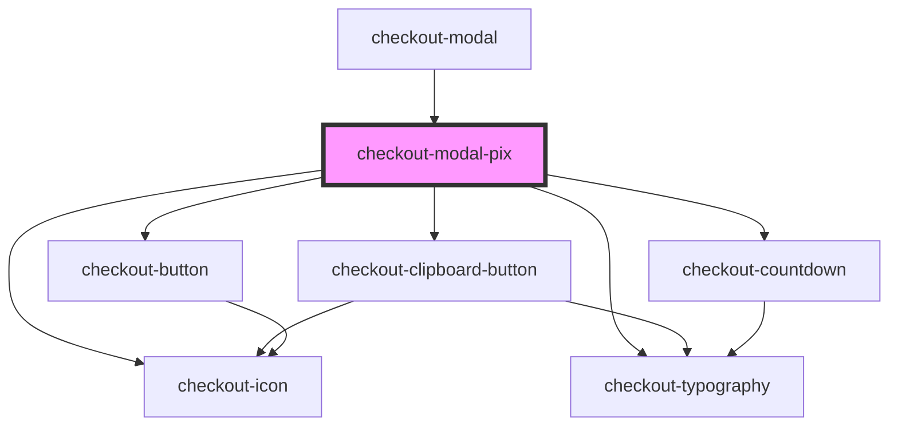

# checkout-modal-pix

<!-- Auto Generated Below -->

## Properties

| Property                          | Attribute                             | Description | Type       | Default                                                                                                                                                                                                                                                          |
| --------------------------------- | ------------------------------------- | ----------- | ---------- | ---------------------------------------------------------------------------------------------------------------------------------------------------------------------------------------------------------------------------------------------------------------- |
| `actionButtonLabel`               | `action-button-label`                 |             | `string`   | `'Continuar'`                                                                                                                                                                                                                                                    |
| `amount`                          | `amount`                              |             | `number`   | `undefined`                                                                                                                                                                                                                                                      |
| `countdownEmptyProgressBarColor`  | `countdown-empty-progress-bar-color`  |             | `string`   | `undefined`                                                                                                                                                                                                                                                      |
| `countdownFilledProgressBarColor` | `countdown-filled-progress-bar-color` |             | `string`   | `undefined`                                                                                                                                                                                                                                                      |
| `currency`                        | `currency`                            |             | `string`   | `undefined`                                                                                                                                                                                                                                                      |
| `expirationTime`                  | `expiration-time`                     |             | `number`   | `undefined`                                                                                                                                                                                                                                                      |
| `importantMessages`               | --                                    |             | `string[]` | `[     `Vamos avisar por e-mail quando o banco identificar o depósito.   Esse processo é automático.`,     `Caso o tempo de pagamento tenha expirado e o Pix não tenha sido pago, seu pedido será cancelado automaticamente. Não pague após este horário.`,   ]` |
| `qrCodeIdentificator`             | `qr-code-identificator`               |             | `string`   | `undefined`                                                                                                                                                                                                                                                      |
| `qrCodeImageUrl`                  | `qr-code-image-url`                   |             | `string`   | `undefined`                                                                                                                                                                                                                                                      |
| `waitingPaymentMessage`           | `waiting-payment-message`             |             | `string`   | `'Pedido aguardando pagamento!'`                                                                                                                                                                                                                                 |

## Events

| Event                      | Description | Type                |
| -------------------------- | ----------- | ------------------- |
| `countdownIsFinished`      |             | `CustomEvent<void>` |
| `pixActionButtonIsClicked` |             | `CustomEvent<void>` |

## Dependencies

### Used by

 - [checkout-modal](../..)

### Depends on

- [checkout-icon](../../../checkout-icon)
- [checkout-typography](../../../checkout-typography)
- [checkout-clipboard-button](../../../checkout-clipboard-button)
- [checkout-button](../../../checkout-button)
- [checkout-countdown](../../../checkout-countdown)

### Graph

----------------------------------------------

*Built with [StencilJS](https://stenciljs.com/)*
