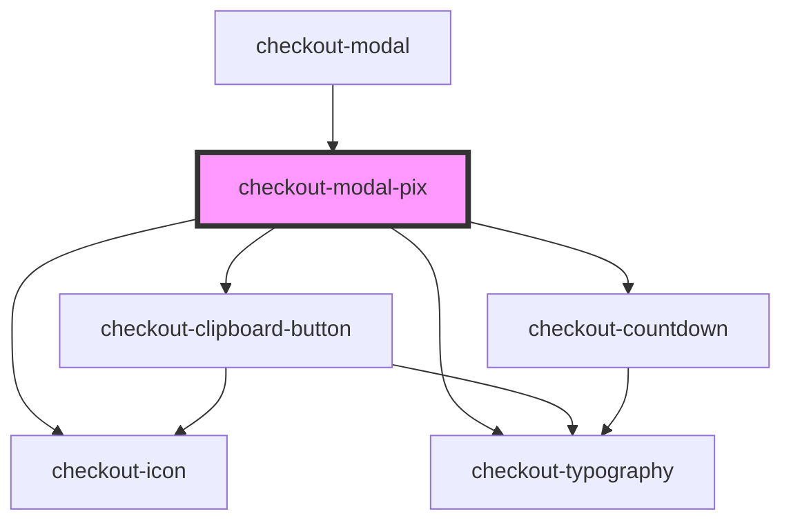

# checkout-modal-pix

<!-- Auto Generated Below -->

## Properties

| Property              | Attribute               | Description | Type     | Default     |
| --------------------- | ----------------------- | ----------- | -------- | ----------- |
| `amount`              | `amount`                |             | `number` | `undefined` |
| `expirationDate`      | `expiration-date`       |             | `string` | `undefined` |
| `expirationTime`      | `expiration-time`       |             | `number` | `undefined` |
| `qrCodeIdentificator` | `qr-code-identificator` |             | `string` | `undefined` |
| `qrCodeImageUrl`      | `qr-code-image-url`     |             | `string` | `undefined` |

## Dependencies

### Used by

 - [checkout-modal](../..)

### Depends on

- [checkout-icon](../../../checkout-icon)
- [checkout-typography](../../../checkout-typography)
- [checkout-clipboard-button](../../../checkout-clipboard-button)
- [checkout-countdown](../../../checkout-countdown)

### Graph

----------------------------------------------

*Built with [StencilJS](https://stenciljs.com/)*
