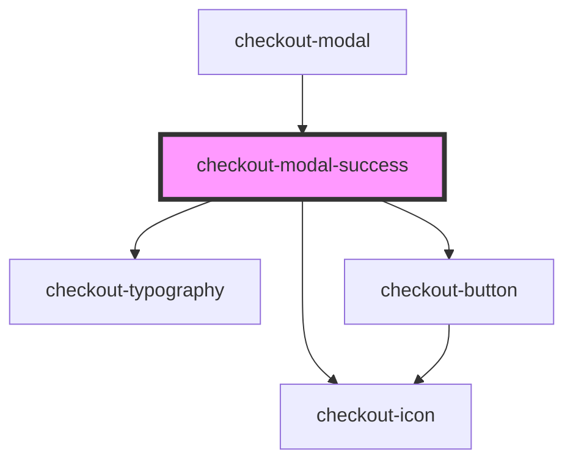

# checkout-modal-success

<!-- Auto Generated Below -->

## Properties

| Property                   | Attribute                     | Description | Type      | Default                          |
| -------------------------- | ----------------------------- | ----------- | --------- | -------------------------------- |
| `hasSuccessRedirectUrl`    | `has-success-redirect-url`    |             | `boolean` | `undefined`                      |
| `successActionButtonLabel` | `success-action-button-label` |             | `string`  | `'Continuar'`                    |
| `successDescription`       | `success-description`         |             | `string`  | `'Pedido recebido com sucesso!'` |

## Events

| Event                        | Description | Type                |
| ---------------------------- | ----------- | ------------------- |
| `successActionButtonClicked` |             | `CustomEvent<void>` |

## Dependencies

### Used by

 - [checkout-modal](../..)

### Depends on

- [checkout-icon](../../../checkout-icon)
- [checkout-typography](../../../checkout-typography)
- [checkout-button](../../../checkout-button)

### Graph

----------------------------------------------

*Built with [StencilJS](https://stenciljs.com/)*
