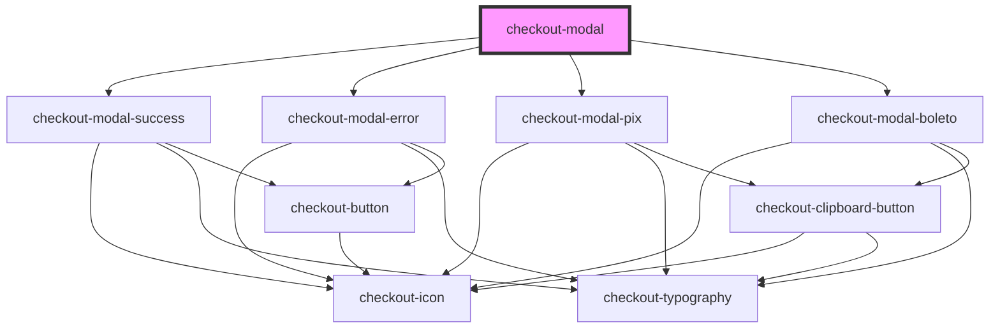

# checkout-modal

<!-- Auto Generated Below -->

## Properties

| Property           | Attribute           | Description | Type                                        | Default     |
| ------------------ | ------------------- | ----------- | ------------------------------------------- | ----------- |
| `amount`           | `amount`            |             | `number`                                    | `undefined` |
| `errorDescription` | `error-description` |             | `string`                                    | `undefined` |
| `errorTitle`       | `error-title`       |             | `string`                                    | `undefined` |
| `expirationDate`   | `expiration-date`   |             | `string`                                    | `undefined` |
| `expirationTime`   | `expiration-time`   |             | `number`                                    | `undefined` |
| `mode`             | `mode`              |             | `"boleto" \| "error" \| "pix" \| "success"` | `undefined` |
| `open`             | `open`              |             | `boolean`                                   | `undefined` |
| `paymentCode`      | `payment-code`      |             | `string`                                    | `undefined` |
| `paymentImageUrl`  | `payment-image-url` |             | `string`                                    | `undefined` |

## Events

| Event                  | Description | Type               |
| ---------------------- | ----------- | ------------------ |
| `errorButtonClicked`   |             | `CustomEvent<any>` |
| `successButtonClicked` |             | `CustomEvent<any>` |

## Dependencies

### Depends on

- [checkout-modal-success](./partials/checkout-modal-success)
- [checkout-modal-error](./partials/checkout-modal-error)
- [checkout-modal-pix](./partials/checkout-modal-pix)
- [checkout-modal-boleto](./partials/checkout-modal-boleto)

### Graph

----------------------------------------------

*Built with [StencilJS](https://stenciljs.com/)*
