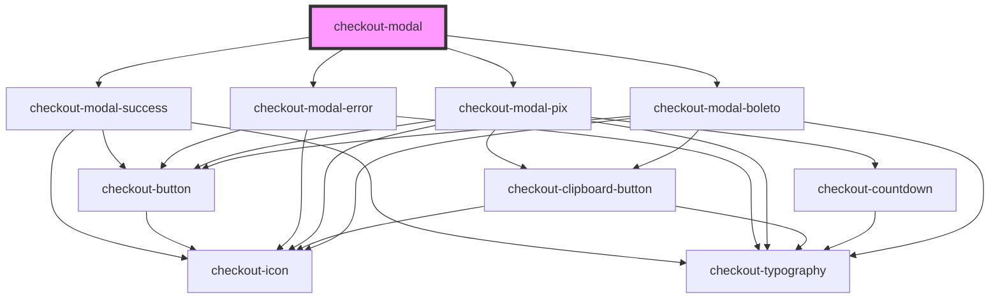

# checkout-modal

<!-- Auto Generated Below -->

## Properties

| Property                      | Attribute                        | Description | Type                                        | Default     |
| ----------------------------- | -------------------------------- | ----------- | ------------------------------------------- | ----------- |
| `actionButtonLabel`           | `action-button-label`            |             | `string`                                    | `undefined` |
| `amount`                      | `amount`                         |             | `number`                                    | `undefined` |
| `boletoWaitingPaymentMessage` | `boleto-waiting-payment-message` |             | `string`                                    | `undefined` |
| `currency`                    | `currency`                       |             | `string`                                    | `undefined` |
| `errorActionButtonLabel`      | `error-action-button-label`      |             | `string`                                    | `undefined` |
| `errorDescription`            | `error-description`              |             | `string`                                    | `undefined` |
| `errorSubtitle`               | `error-subtitle`                 |             | `string`                                    | `undefined` |
| `errorTitle`                  | `error-title`                    |             | `string`                                    | `undefined` |
| `expirationDate`              | `expiration-date`                |             | `string`                                    | `undefined` |
| `expirationTime`              | `expiration-time`                |             | `number`                                    | `undefined` |
| `hasSuccessRedirectUrl`       | `has-success-redirect-url`       |             | `boolean`                                   | `undefined` |
| `isSession`                   | `is-session`                     |             | `boolean`                                   | `undefined` |
| `mode`                        | `mode`                           |             | `"boleto" \| "error" \| "pix" \| "success"` | `undefined` |
| `open`                        | `open`                           |             | `boolean`                                   | `undefined` |
| `paymentCode`                 | `payment-code`                   |             | `string`                                    | `undefined` |
| `paymentImageUrl`             | `payment-image-url`              |             | `string`                                    | `undefined` |
| `pixEmptyProgressBarColor`    | `pix-empty-progress-bar-color`   |             | `string`                                    | `undefined` |
| `pixFilledProgressBarColor`   | `pix-filled-progress-bar-color`  |             | `string`                                    | `undefined` |
| `pixImportantMessages`        | --                               |             | `string[]`                                  | `undefined` |
| `pixWaitingPaymentMessage`    | `pix-waiting-payment-message`    |             | `string`                                    | `undefined` |
| `successActionButtonLabel`    | `success-action-button-label`    |             | `string`                                    | `undefined` |
| `successDescription`          | `success-description`            |             | `string`                                    | `undefined` |

## Events

| Event                    | Description | Type                |
| ------------------------ | ----------- | ------------------- |
| `errorButtonClicked`     |             | `CustomEvent<void>` |
| `pixCountdownIsFinished` |             | `CustomEvent<void>` |
| `successButtonClicked`   |             | `CustomEvent<void>` |

## Dependencies

### Depends on

- [checkout-modal-success](./partials/checkout-modal-success)
- [checkout-modal-error](./partials/checkout-modal-error)
- [checkout-modal-pix](./partials/checkout-modal-pix)
- [checkout-modal-boleto](./partials/checkout-modal-boleto)

### Graph

----------------------------------------------

*Built with [StencilJS](https://stenciljs.com/)*
