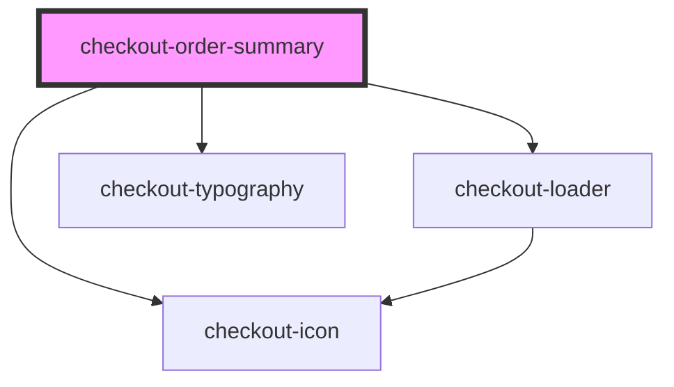

# checkout-order-summary

<!-- Auto Generated Below -->

## Properties

| Property    | Attribute    | Description | Type                                                                    | Default     |
| ----------- | ------------ | ----------- | ----------------------------------------------------------------------- | ----------- |
| `amount`    | `amount`     |             | `number`                                                                | `undefined` |
| `currency`  | `currency`   |             | `string`                                                                | `undefined` |
| `delivery`  | `delivery`   |             | `number`                                                                | `undefined` |
| `fullWidth` | `full-width` |             | `boolean`                                                               | `false`     |
| `isLoading` | `is-loading` |             | `boolean`                                                               | `false`     |
| `label`     | `label`      |             | `string`                                                                | `undefined` |
| `locale`    | `locale`     |             | `"default" \| "en" \| "en-US" \| "en_US" \| "pt" \| "pt-BR" \| "pt_BR"` | `undefined` |
| `products`  | --           |             | `Product[]`                                                             | `undefined` |

## Dependencies

### Depends on

- [checkout-loader](../checkout-loader)
- [checkout-typography](../checkout-typography)
- [checkout-icon](../checkout-icon)

### Graph

----------------------------------------------

*Built with [StencilJS](https://stenciljs.com/)*
