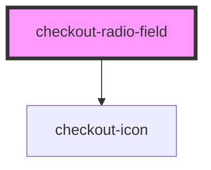

# checkout-radio-field

<!-- Auto Generated Below -->

## Properties

| Property               | Attribute                | Description | Type                                                                                                                                                                                                                                                                                                                                                                                                            | Default     |
| ---------------------- | ------------------------ | ----------- | --------------------------------------------------------------------------------------------------------------------------------------------------------------------------------------------------------------------------------------------------------------------------------------------------------------------------------------------------------------------------------------------------------------- | ----------- |
| `customContainerClass` | `custom-container-class` |             | `string`                                                                                                                                                                                                                                                                                                                                                                                                        | `undefined` |
| `customInputClass`     | `custom-input-class`     |             | `string`                                                                                                                                                                                                                                                                                                                                                                                                        | `undefined` |
| `customLabelClass`     | `custom-label-class`     |             | `string`                                                                                                                                                                                                                                                                                                                                                                                                        | `undefined` |
| `endIcon`              | `end-icon`               |             | `"arrowDown" \| "calendar" \| "check" \| "creditCard" \| "cvv" \| "dollar" \| "lock" \| "spinner" \| "user" \| "warning" \| "poweredByMalga" \| "edit" \| "eye" \| "eyeSlash" \| "arrowLeft" \| "error" \| "checkLarge" \| "clipboard" \| "pix" \| "newTab" \| "american-express" \| "diners-club" \| "discover" \| "elo" \| "hipercard" \| "mastercard" \| "visa" \| "globe" \| "nubank" \| "drip" \| "close"` | `undefined` |
| `fullWidth`            | `full-width`             |             | `boolean`                                                                                                                                                                                                                                                                                                                                                                                                       | `false`     |
| `isChecked`            | `is-checked`             |             | `boolean`                                                                                                                                                                                                                                                                                                                                                                                                       | `false`     |
| `label`                | `label`                  |             | `string`                                                                                                                                                                                                                                                                                                                                                                                                        | `undefined` |
| `value`                | `value`                  |             | `number \| string`                                                                                                                                                                                                                                                                                                                                                                                              | `''`        |

## Events

| Event     | Description | Type                                         |
| --------- | ----------- | -------------------------------------------- |
| `changed` |             | `CustomEvent<CheckoutRadioFieldChangeEvent>` |
| `clicked` |             | `CustomEvent<MouseEvent>`                    |
| `inputed` |             | `CustomEvent<KeyboardEvent>`                 |

## Dependencies

### Depends on

- [checkout-icon](../checkout-icon)

### Graph

----------------------------------------------

*Built with [StencilJS](https://stenciljs.com/)*
