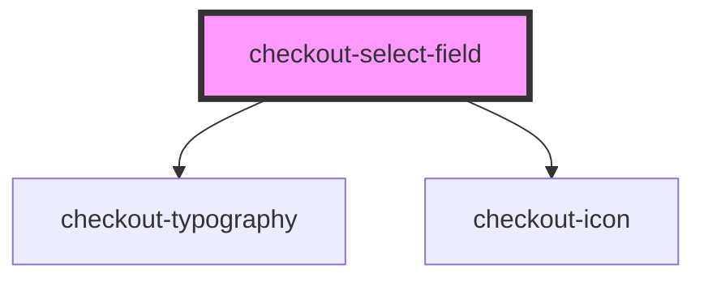

# checkout-select-field

<!-- Auto Generated Below -->

## Properties

| Property               | Attribute                | Description | Type                           | Default     |
| ---------------------- | ------------------------ | ----------- | ------------------------------ | ----------- |
| `autofocus`            | `autofocus`              |             | `boolean`                      | `false`     |
| `customContainerClass` | `custom-container-class` |             | `string`                       | `undefined` |
| `customLabelClass`     | `custom-label-class`     |             | `string`                       | `undefined` |
| `customSelectClass`    | `custom-select-class`    |             | `string`                       | `undefined` |
| `disabled`             | `disabled`               |             | `boolean`                      | `false`     |
| `fullWidth`            | `full-width`             |             | `boolean`                      | `false`     |
| `hasError`             | `has-error`              |             | `boolean`                      | `undefined` |
| `label`                | `label`                  |             | `string`                       | `undefined` |
| `name`                 | `name`                   |             | `string`                       | `undefined` |
| `noneOptionLabel`      | `none-option-label`      |             | `string`                       | `undefined` |
| `options`              | --                       |             | `CheckoutSelectFieldOptions[]` | `[]`        |
| `placeholder`          | `placeholder`            |             | `string`                       | `undefined` |
| `readonly`             | `readonly`               |             | `boolean`                      | `false`     |
| `required`             | `required`               |             | `boolean`                      | `false`     |
| `value`                | `value`                  |             | `number \| string`             | `'none'`    |

## Events

| Event     | Description | Type                                          |
| --------- | ----------- | --------------------------------------------- |
| `blurred` |             | `CustomEvent<void>`                           |
| `changed` |             | `CustomEvent<CheckoutSelectFieldChangeEvent>` |
| `focused` |             | `CustomEvent<void>`                           |
| `inputed` |             | `CustomEvent<KeyboardEvent>`                  |

## Dependencies

### Depends on

- [checkout-typography](../checkout-typography)
- [checkout-icon](../checkout-icon)

### Graph

----------------------------------------------

*Built with [StencilJS](https://stenciljs.com/)*
