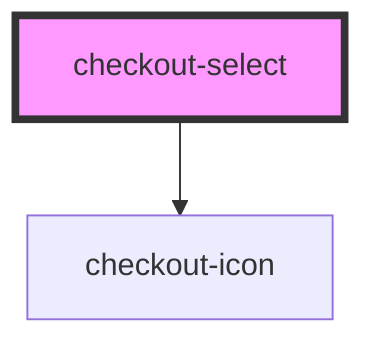

# checkout-select

<!-- Auto Generated Below -->

## Properties

| Property               | Attribute                | Description | Type                                                                                                                                                                                                                                   | Default     |
| ---------------------- | ------------------------ | ----------- | -------------------------------------------------------------------------------------------------------------------------------------------------------------------------------------------------------------------------------------- | ----------- |
| `autofocus`            | `autofocus`              |             | `boolean`                                                                                                                                                                                                                              | `false`     |
| `customContainerClass` | `custom-container-class` |             | `string`                                                                                                                                                                                                                               | `undefined` |
| `customLabelClass`     | `custom-label-class`     |             | `string`                                                                                                                                                                                                                               | `undefined` |
| `customSelectClass`    | `custom-select-class`    |             | `string`                                                                                                                                                                                                                               | `undefined` |
| `disabled`             | `disabled`               |             | `boolean`                                                                                                                                                                                                                              | `false`     |
| `fullWidth`            | `full-width`             |             | `boolean`                                                                                                                                                                                                                              | `false`     |
| `hasError`             | `has-error`              |             | `boolean`                                                                                                                                                                                                                              | `undefined` |
| `hasValidation`        | `has-validation`         |             | `boolean`                                                                                                                                                                                                                              | `true`      |
| `label`                | `label`                  |             | `string`                                                                                                                                                                                                                               | `undefined` |
| `name`                 | `name`                   |             | `string`                                                                                                                                                                                                                               | `undefined` |
| `options`              | --                       |             | `CheckoutSelectOptions[]`                                                                                                                                                                                                              | `[]`        |
| `placeholder`          | `placeholder`            |             | `string`                                                                                                                                                                                                                               | `undefined` |
| `readonly`             | `readonly`               |             | `boolean`                                                                                                                                                                                                                              | `false`     |
| `required`             | `required`               |             | `boolean`                                                                                                                                                                                                                              | `false`     |
| `startIcon`            | `start-icon`             |             | `"arrowDown" \| "arrowLeft" \| "calendar" \| "check" \| "checkLarge" \| "clipboard" \| "creditCard" \| "cvv" \| "dollar" \| "edit" \| "error" \| "eye" \| "eyeSlash" \| "lock" \| "poweredByPlug" \| "spinner" \| "user" \| "warning"` | `undefined` |
| `value`                | `value`                  |             | `number \| string`                                                                                                                                                                                                                     | `'none'`    |

## Events

| Event     | Description | Type                                     |
| --------- | ----------- | ---------------------------------------- |
| `blurred` |             | `CustomEvent<void>`                      |
| `changed` |             | `CustomEvent<CheckoutSelectChangeEvent>` |
| `focused` |             | `CustomEvent<void>`                      |
| `inputed` |             | `CustomEvent<KeyboardEvent>`             |

## Dependencies

### Depends on

- [checkout-icon](../checkout-icon)

### Graph

----------------------------------------------

*Built with [StencilJS](https://stenciljs.com/)*
