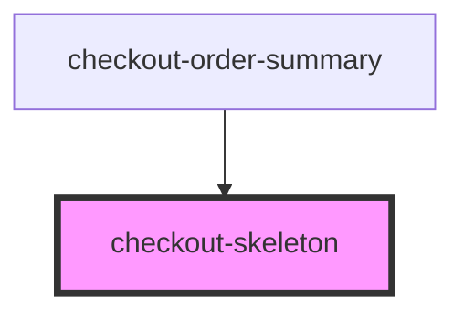

# checkout-skeleton

<!-- Auto Generated Below -->

## Properties

| Property | Attribute | Description | Type     | Default     |
| -------- | --------- | ----------- | -------- | ----------- |
| `class`  | `class`   |             | `string` | `undefined` |
| `width`  | `width`   |             | `string` | `undefined` |

## Dependencies

### Used by

 - [checkout-order-summary](../checkout-order-summary)

### Graph

----------------------------------------------

*Built with [StencilJS](https://stenciljs.com/)*
