# checkout-typography

<!-- Auto Generated Below -->

## Properties

| Property    | Attribute   | Description | Type                                                                                                                        | Default     |
| ----------- | ----------- | ----------- | --------------------------------------------------------------------------------------------------------------------------- | ----------- |
| `color`     | `color`     |             | `"dark" \| "darkness" \| "warning" \| "white"`                                                                              | `'dark'`    |
| `content`   | `content`   |             | `string`                                                                                                                    | `undefined` |
| `styles`    | --          |             | `{}`                                                                                                                        | `{}`        |
| `tag`       | `tag`       |             | `string`                                                                                                                    | `'p'`       |
| `variation` | `variation` |             | `"body1" \| "body2" \| "button" \| "field" \| "header5" \| "header6" \| "header7" \| "label" \| "subtitle1" \| "subtitle2"` | `'body1'`   |

## Dependencies

### Used by

 - [checkout-clipboard-button](../checkout-clipboard-button)
 - [checkout-countdown](../checkout-countdown)
 - [checkout-error-message](../checkout-error-message)
 - [checkout-manual-payment](../checkout-manual-payment)
 - [checkout-modal-boleto](../checkout-modal/partials/checkout-modal-boleto)
 - [checkout-modal-error](../checkout-modal/partials/checkout-modal-error)
 - [checkout-modal-pix](../checkout-modal/partials/checkout-modal-pix)
 - [checkout-modal-success](../checkout-modal/partials/checkout-modal-success)
 - [checkout-order-summary](../checkout-order-summary)
 - [checkout-select-field](../checkout-select-field)
 - [checkout-text-field](../checkout-text-field)

### Graph

```mermaid
graph TD;
  checkout-clipboard-button --> checkout-typography
  checkout-countdown --> checkout-typography
  checkout-error-message --> checkout-typography
  checkout-manual-payment --> checkout-typography
  checkout-modal-boleto --> checkout-typography
  checkout-modal-error --> checkout-typography
  checkout-modal-pix --> checkout-typography
  checkout-modal-success --> checkout-typography
  checkout-order-summary --> checkout-typography
  checkout-select-field --> checkout-typography
  checkout-text-field --> checkout-typography
  style checkout-typography fill:#f9f,stroke:#333,stroke-width:4px
```

----------------------------------------------

*Built with [StencilJS](https://stenciljs.com/)*
