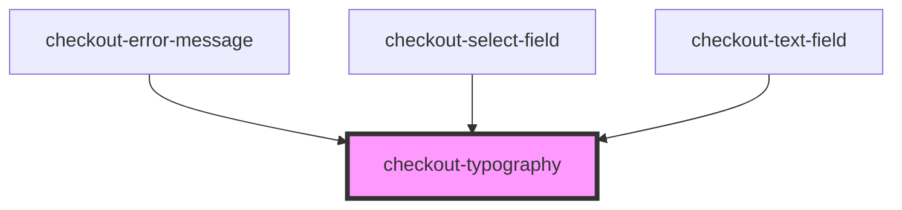

# checkout-typography

<!-- Auto Generated Below -->

## Properties

| Property    | Attribute   | Description | Type                                                                                                           | Default     |
| ----------- | ----------- | ----------- | -------------------------------------------------------------------------------------------------------------- | ----------- |
| `color`     | `color`     |             | `"dark" \| "darkness" \| "warning" \| "white"`                                                                 | `'dark'`    |
| `content`   | `content`   |             | `string`                                                                                                       | `undefined` |
| `tag`       | `tag`       |             | `string`                                                                                                       | `'p'`       |
| `variation` | `variation` |             | `"body1" \| "body2" \| "button" \| "field" \| "header5" \| "header6" \| "label" \| "subtitle1" \| "subtitle2"` | `'body1'`   |

## Dependencies

### Used by

 - [checkout-error-message](../checkout-error-message)
 - [checkout-select-field](../checkout-select-field)
 - [checkout-text-field](../checkout-text-field)

### Graph

----------------------------------------------

*Built with [StencilJS](https://stenciljs.com/)*
