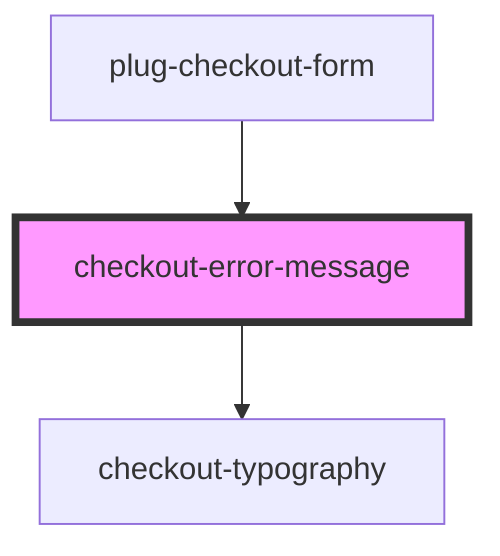

# checkout-error-message

<!-- Auto Generated Below -->

## Properties

| Property      | Attribute      | Description | Type      | Default     |
| ------------- | -------------- | ----------- | --------- | ----------- |
| `customClass` | `custom-class` |             | `string`  | `undefined` |
| `fullWidth`   | `full-width`   |             | `boolean` | `false`     |
| `message`     | `message`      |             | `string`  | `undefined` |

## Dependencies

### Used by

 - [plug-checkout-form](../../components/plug-checkout/partials/plug-checkout-form)

### Depends on

- [checkout-typography](../checkout-typography)

### Graph

----------------------------------------------

*Built with [StencilJS](https://stenciljs.com/)*
