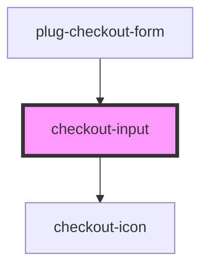

# checkout-input

<!-- Auto Generated Below -->

## Properties

| Property               | Attribute                | Description | Type                                                                                                                      | Default     |
| ---------------------- | ------------------------ | ----------- | ------------------------------------------------------------------------------------------------------------------------- | ----------- |
| `autofocus`            | `autofocus`              |             | `boolean`                                                                                                                 | `false`     |
| `customContainerClass` | `custom-container-class` |             | `string`                                                                                                                  | `undefined` |
| `customInputClass`     | `custom-input-class`     |             | `string`                                                                                                                  | `undefined` |
| `customLabelClass`     | `custom-label-class`     |             | `string`                                                                                                                  | `undefined` |
| `disabled`             | `disabled`               |             | `boolean`                                                                                                                 | `false`     |
| `fullWidth`            | `full-width`             |             | `boolean`                                                                                                                 | `false`     |
| `hasError`             | `has-error`              |             | `boolean`                                                                                                                 | `undefined` |
| `hasValidation`        | `has-validation`         |             | `boolean`                                                                                                                 | `undefined` |
| `inputmode`            | `inputmode`              |             | `"decimal" \| "email" \| "none" \| "numeric" \| "search" \| "tel" \| "text" \| "url"`                                     | `'text'`    |
| `label`                | `label`                  |             | `string`                                                                                                                  | `undefined` |
| `mask`                 | `mask`                   |             | `string`                                                                                                                  | `undefined` |
| `max`                  | `max`                    |             | `string`                                                                                                                  | `undefined` |
| `maxlength`            | `maxlength`              |             | `number`                                                                                                                  | `undefined` |
| `min`                  | `min`                    |             | `string`                                                                                                                  | `undefined` |
| `minlength`            | `minlength`              |             | `number`                                                                                                                  | `undefined` |
| `multiple`             | `multiple`               |             | `boolean`                                                                                                                 | `undefined` |
| `name`                 | `name`                   |             | `string`                                                                                                                  | `undefined` |
| `placeholder`          | `placeholder`            |             | `string`                                                                                                                  | `undefined` |
| `readonly`             | `readonly`               |             | `boolean`                                                                                                                 | `false`     |
| `required`             | `required`               |             | `boolean`                                                                                                                 | `false`     |
| `startIcon`            | `start-icon`             |             | `"arrowDown" \| "calendar" \| "check" \| "creditCard" \| "cvv" \| "dollar" \| "lock" \| "spinner" \| "user" \| "warning"` | `undefined` |
| `type`                 | `type`                   |             | `"date" \| "email" \| "number" \| "password" \| "search" \| "tel" \| "text" \| "time" \| "url"`                           | `'text'`    |
| `value`                | `value`                  |             | `number \| string`                                                                                                        | `''`        |

## Events

| Event     | Description | Type                                    |
| --------- | ----------- | --------------------------------------- |
| `blurred` |             | `CustomEvent<FocusEvent>`               |
| `changed` |             | `CustomEvent<CheckoutInputChangeEvent>` |
| `focused` |             | `CustomEvent<FocusEvent>`               |
| `inputed` |             | `CustomEvent<KeyboardEvent>`            |

## Dependencies

### Used by

 - [plug-checkout-form](../../components/plug-checkout/partials/plug-checkout-form)

### Depends on

- [checkout-icon](../checkout-icon)

### Graph

----------------------------------------------

*Built with [StencilJS](https://stenciljs.com/)*
