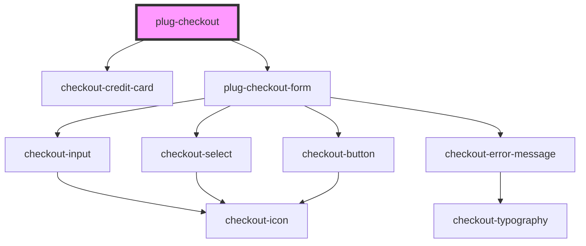

# plug-checkout

<!-- Auto Generated Below -->

## Properties

| Property                 | Attribute              | Description | Type                                     | Default                        |
| ------------------------ | ---------------------- | ----------- | ---------------------------------------- | ------------------------------ |
| `amount`                 | `amount`               |             | `number`                                 | `undefined`                    |
| `apiKey`                 | `api-key`              |             | `string`                                 | `undefined`                    |
| `capture`                | `capture`              |             | `boolean`                                | `false`                        |
| `clientId`               | `client-id`            |             | `string`                                 | `undefined`                    |
| `customFormStyleClasses` | --                     |             | `PlugCheckoutFormCustomStyleFormClasses` | `defaultCustomStyles`          |
| `installmentsConfig`     | --                     |             | `PlugCheckoutInstallmentsConfig`         | `{ show: true, quantity: 1, }` |
| `merchantId`             | `merchant-id`          |             | `string`                                 | `undefined`                    |
| `statementDescriptor`    | `statement-descriptor` |             | `string`                                 | `undefined`                    |

## Dependencies

### Depends on

- [checkout-credit-card](../../partials/checkout-credit-card)
- [plug-checkout-form](./partials/plug-checkout-form)

### Graph

---

_Built with [StencilJS](https://stenciljs.com/)_
