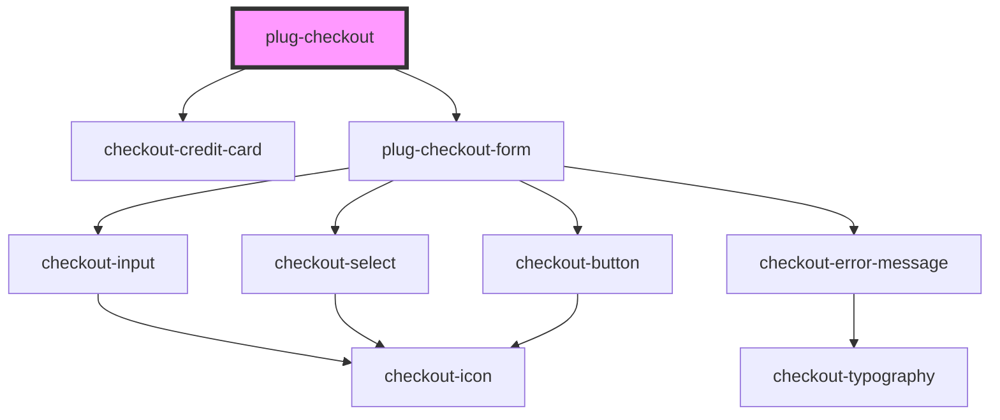

# plug-checkout

<!-- Auto Generated Below -->

## Properties

| Property                 | Attribute              | Description | Type                                     | Default                                  |
| ------------------------ | ---------------------- | ----------- | ---------------------------------------- | ---------------------------------------- |
| `amount`                 | `amount`               |             | `number`                                 | `undefined`                              |
| `capture`                | `capture`              |             | `boolean`                                | `false`                                  |
| `clientId`               | `client-id`            |             | `string`                                 | `undefined`                              |
| `customFormStyleClasses` | --                     |             | `PlugCheckoutFormCustomStyleFormClasses` | `defaultCustomStyles`                    |
| `installmentsConfig`     | --                     |             | `PlugCheckoutInstallmentsConfig`         | `{     show: true,     quantity: 1,   }` |
| `merchantId`             | `merchant-id`          |             | `string`                                 | `undefined`                              |
| `publicKey`              | `public-key`           |             | `string`                                 | `undefined`                              |
| `sandbox`                | `sandbox`              |             | `boolean`                                | `false`                                  |
| `statementDescriptor`    | `statement-descriptor` |             | `string`                                 | `undefined`                              |

## Events

| Event            | Description | Type                                                 |
| ---------------- | ----------- | ---------------------------------------------------- |
| `paymentFailed`  |             | `CustomEvent<{ error: PlugCheckoutOneShotError; }>`  |
| `paymentSuccess` |             | `CustomEvent<{ data: PlugCheckoutOneShotSuccess; }>` |

## Dependencies

### Depends on

- [checkout-credit-card](../../partials/checkout-credit-card)
- [plug-checkout-form](./partials/plug-checkout-form)

### Graph

----------------------------------------------

*Built with [StencilJS](https://stenciljs.com/)*
