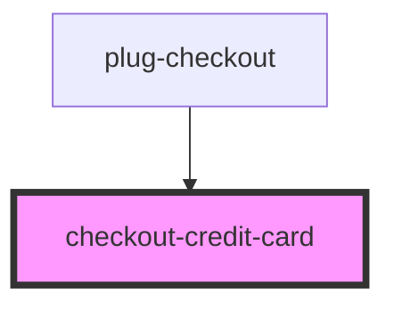

# checkout-credit-card

<!-- Auto Generated Below -->

## Properties

| Property       | Attribute | Description | Type                 | Default                     |
| -------------- | --------- | ----------- | -------------------- | --------------------------- |
| `cvv`          | `cvv`     |             | `string`             | `undefined`                 |
| `expiry`       | `expiry`  |             | `string`             | `undefined`                 |
| `focused`      | `focused` |             | `string`             | `undefined`                 |
| `issuer`       | `issuer`  |             | `string`             | `undefined`                 |
| `locale`       | --        |             | `{ valid: string; }` | `{ valid: 'valido ate' }`   |
| `name`         | `name`    |             | `string`             | `undefined`                 |
| `number`       | `number`  |             | `string`             | `undefined`                 |
| `placeholders` | --        |             | `{ name: string; }`  | `{ name: 'Nome Completo' }` |

## Dependencies

### Used by

 - [plug-checkout](../../components/plug-checkout)

### Graph

----------------------------------------------

*Built with [StencilJS](https://stenciljs.com/)*
